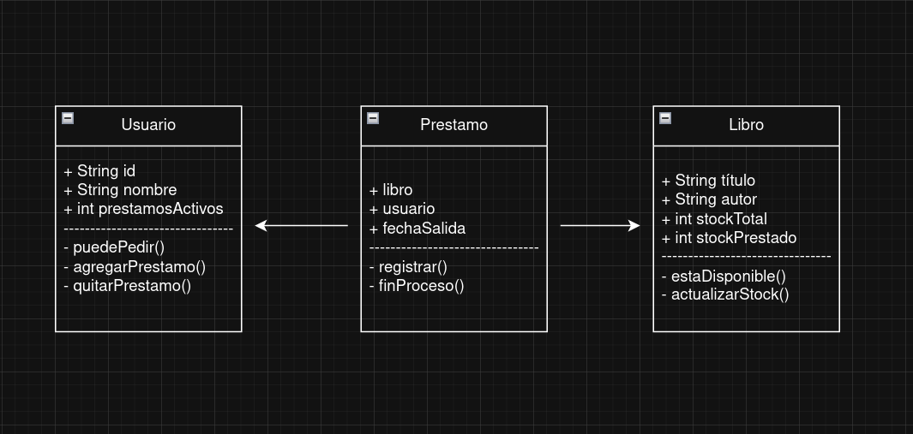

# Avance de proyecto
## Objetivo: 
Diseñar y modelar un sistema integral de gestión bibliotecaria aplicando los principios fundamentales de la POO, utilizando diagramas de clases UML para visualizar la estructura lógica y facilitar su posterior implementación en un entorno de desarrollo efectivo.
## Introducción: 
El diseño de sistemas complejos requiere de una estructura que garantice la integridad de los datos y la fluidez de los procesos. En el presente modelado, se describe un Sistema de Gestión de Biblioteca fundamentado en el paradigma de la Programación Orientada a Objetos (POO). Este sistema no solo se limita a almacenar información, sino que establece una red de interacciones entre tres pilares fundamentales: el Libro (recurso), el Usuario (cliente) y el Préstamo (transacción). A través del uso de la notación UML (Unified Modeling Language), se ha diseñado una arquitectura que permite controlar el inventario en tiempo real, validar las reglas de negocio (como la disponibilidad y los límites del usuario) y asegurar la trazabilidad de cada ejemplar mediante un ciclo de vida de objetos bien definido.                         

### Objetivos Específicos:
* Definir Entidades: Identificar los atributos y métodos clave de las clases Libro, Usuario y Prestamo.
* Establecer Relaciones: Determinar las asociaciones y dependencias entre los objetos para garantizar la coherencia del sistema (ej. un préstamo no existe sin un libro).
* Gestionar Lógica de Negocio: Implementar mecanismos de control como estaDisponible() y puedePedir() para automatizar la toma de decisiones del software.
* Garantizar Escalabilidad: Crear una base sólida que permita, en etapas futuras, añadir nuevas funcionalidades como multas, categorías de libros o niveles de membresía.

### 1. Especificaciones de la Clase Libro
Es la entidad que gestiona el inventario físico de la obra.
* Atributos de Estado:
  * stockTotal: Representa la cantidad máxima de ejemplares que posee la biblioteca (valor estático a menos que se compren nuevos libros).
  * stockPrestado: Es un contador dinámico que rastrea cuántas unidades están fuera de la biblioteca.
* Lógica de los Métodos:
  * estaDisponible(): Debe retornar un valor booleano (verdadero/falso). La lógica interna es: si stockPrestado < stockTotal, el libro puede prestarse.
  * actualizarStock(): Se activa cada vez que se concreta un préstamo (suma 1 al stock prestado) o una devolución (resta 1 al stock prestado).
### 2. Especificaciones de la Clase Usuario
Gestiona el perfil del cliente y sus privilegios de préstamo.
* Atributos de Identificación y Control:
  * id y nombre: Datos básicos para la trazabilidad de la transacción.
  * prestamosActivos: Un contador entero que suma cada libro que el usuario tiene en su poder. Es crucial para evitar abusos del sistema.
* Lógica de los Métodos:
  * puedePedir(): Verifica si el usuario cumple con las políticas de la biblioteca (por ejemplo, si tiene menos de 3 libros activos). Si el contador es menor al límite, devuelve "permitido".
  * agregarPrestamo(): Incrementa en 1 el atributo prestamosActivos.
  * quitarPrestamo(): Decrementa en 1 el atributo prestamosActivos al momento de la devolución.
### 3. Especificaciones de la Clase Prestamo
Funciona como la capa de control o "clase de unión" que orquestra la relación entre los otros dos objetos.
* Atributos de Asociación:
  * libro y usuario: No son simples textos, son objetos. El préstamo "apunta" a una instancia específica de un libro y a una de un usuario.
  * fechaSalida: Marca de tiempo para controlar el plazo de entrega.
* Lógica de los Métodos:
  * registrar(): Es el constructor de la transacción. Debe invocar a usuario.agregarPrestamo() y a libro.actualizarStock(). Solo puede ejecutarse si las validaciones de las otras clases dieron "OK".
  * finProceso(): Representa la devolución. Su función es liberar los recursos: llama a usuario.quitarPrestamo() y actualiza el stock del libro para que otros puedan usarlo.
### 4. Flujo de Operación del Sistema
Para que el sistema funcione correctamente, los métodos deben interactuar en este orden lógico:
1. Validación: Se consulta a Usuario.puedePedir() y Libro.estaDisponible().
2. Ejecución: Si ambos son positivos, se crea el objeto Prestamo y se ejecuta registrar().
3. Actualización: El sistema actualiza los contadores internos de las clases Libro y Usuario para reflejar el cambio de estado.

### Definición de Relaciones de Objetos y Clases
En el modelado del Sistema de Gestión de Biblioteca, las relaciones determinan la jerarquía, el ciclo de vida y la comunicación entre los componentes. A continuación, se detallan las relaciones aplicadas al diseño:
### Asociación.
Es la relación estructural que permite que una instancia de una clase se conecte con otra para enviarle mensajes o consultar su estado.
* Aplicación en el diseño: Existe una asociación entre las clases Prestamo, Libro y Usuario.
* Función: La clase Prestamo actúa como el eje central; conoce al Usuario que solicita el servicio y al Libro que será retirado. Sin esta conexión, el sistema no podría vincular la responsabilidad de un ejemplar a una persona específica.
### Agregación.
Representa una relación donde un objeto "posee" a otros, pero estos pueden existir de forma independiente si el contenedor desaparece.
* Aplicación en el diseño: Lógicamente, existe una agregación entre una entidad (no graficada pero implícita) como Inventario y la clase Libro.
* Función: Si el Inventario se reinicia o se elimina, los objetos Libro persisten como registros individuales en la base de datos general de la institución.
### Composición.
Es una forma de dependencia estricta donde la existencia de la "parte" está ligada exclusivamente a la existencia del "todo".
* Aplicación en el diseño: Se aplica en la relación entre Prestamo y el registro de transacciones o posibles Multas.
* Función: Si un registro de Prestamo es eliminado permanentemente del sistema, cualquier objeto de tipo Multa generado por ese préstamo específico debe desaparecer, ya que no tiene sentido de existir sin su transacción de origen.
### Herencia.
Mecanismo que permite a una clase hija adoptar atributos y métodos de una clase padre, facilitando la reutilización de código.

## Diagrama UML

